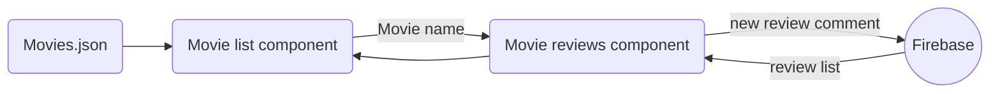
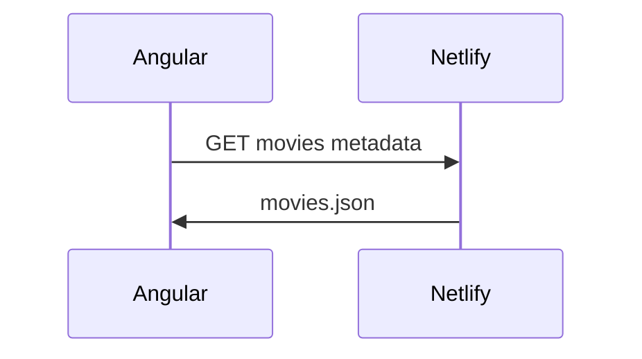
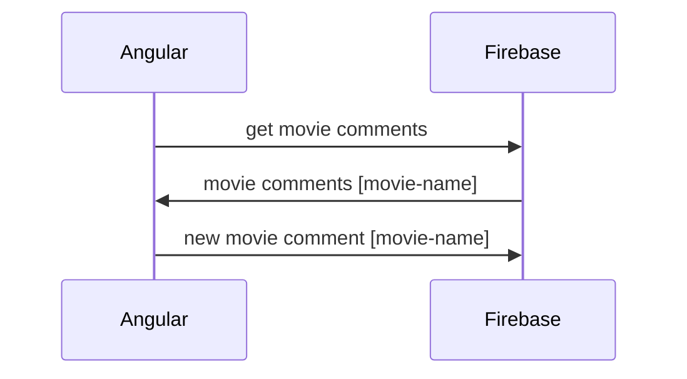

# My movie chat web app

A simple angular app that gets movies metadata from a public API, displays it and save movie comments to firestore.

## How to run the code
	
###  Prerequisites

- Install [Node.js] which includes [Node Package Manager][npm]

- Install the Angular CLI globally:

```

npm install -g @angular/cli

```

- Run the application:

```

ng serve

```
This command will serve the app in port 4200 of you local machine:

```

http://localhost:4200/

```

##  Project architecture



In this project we have a simple Angular app with two components. The first is responsible to list in a table all the movies from a web hosted JSON file with a thousand movie titles along with their metadata. When a movie is selected from the table (clicked) the user is redirected to a movie comments page where he can see all the comments made for that movie along with a input field where he can make a comment himself.

### Movies list component 

In the above diagram we have all the network calls made by the movie listing component. It makes a GET request to a netlify hosted endpoint that returns a JSON with a movie metadata list.

### Movie Comments component


When a movie is selected in the first component the movie title is passed to the movie comment component, that gets all the previous comments for that movie from Firebase from its name and displays. If the user makes a new comment in the available field and submits it a new request is made to Firebase and the new comment is persisted and showed along with the previous ones.


### Firestore data structure

| Collection     |Comment                    
|----------------|-------------------
|Movie title  1   |`This movie is amazing', 'Never seen nothing like this'...`       
|Movie title  2  |`'Didn't like from the first scene'...`       
|  .   | 
|  .   |
|  .   |      

In Firestore we have a collection for each movie that holds many comment objects composed by a comment text and a comment author.

## Future improvements
-   Make it more responsive
-  Implement unity tests
-  Sort movies on column click 
-  get the user name and save as comment author in Firebase


##### Pedro Paulo M. Freitas 2022
